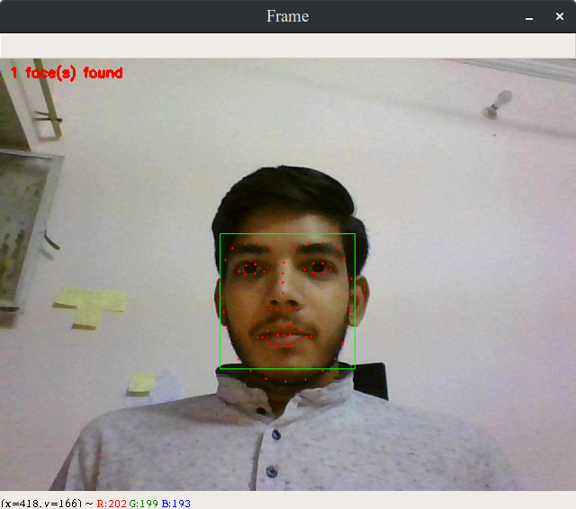
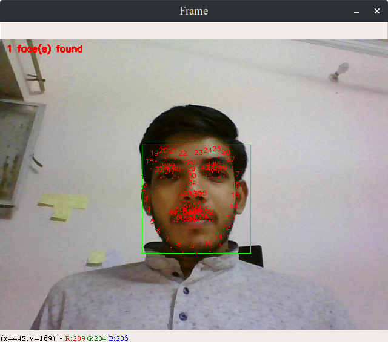
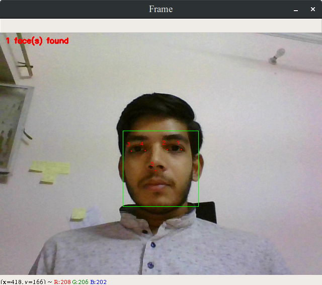

# Face Landmarking

## Introduction

The repository contain code that demonstrate use of face landmarking model and how to create them(to be uploaded soon). For the use of this model I have used dlib for finding landmarks and opencv for camera related operations. The models are not provided in the repository, you can download them using the respective links.

## Landmarking Model

There are different models available for face landmarking:

- 5 point model
  - This face landmarking model returns 5 points on face (left and right corner of both eye and tip of nose)
  - Link to download the dataset will be uploaded soon
- 68 point model
  - This Landmarking model return various point seen in this [picture](https://pyimagesearch.com/wp-content/uploads/2017/04/facial_landmarks_68markup.jpg)
  - trained on [iBYG 300-W dataset](https://ibug.doc.ic.ac.uk/resources/facial-point-annotations/)
  - [link](http://dlib.net/files/shape_predictor_68_face_landmarks.dat.bz2) to pre-trained model
- 194 point model
  - trained on [HELEN dataset](http://www.ifp.illinois.edu/~vuongle2/helen/)

If you are having trouble installing dlib pleasit visit this [Blog](https://www.pyimagesearch.com/2017/03/27/how-to-install-dlib/).

## Getting Started

For working on this project you'll need libraries mentioned in requirements.txt(to be uploaded soon). If you don't have them install them using the following command

```pip install -r requirements.txt```

also There are two parts of the repository the first part demonstrate the use of Face landmarking model with OpenCV and the second part demonstrate how to create your own face landmaring model.

## Keyboard shotcuts

After executing all the cells in jupyter notebook you can use:

- q - Quit/ Exit the window
- n - Toggle between show numbers on final image
- m - change model
  - 5 point model
  - 68 point model

## Screenshots

- 68 point models




- 5 point model



## Todo

- Add GUI features
- Add 194 point model
- Add Error handling

## Built With

- [Opencv](https://opencv.org/)
- [dlib](http://dlib.net/)
- [imutils](https://github.com/jrosebr1/imutils)

## License

This project is licensed under the GNU General Public Licence v3.0 License - see the [LICENSE.md](LICENSE.md) file for details
